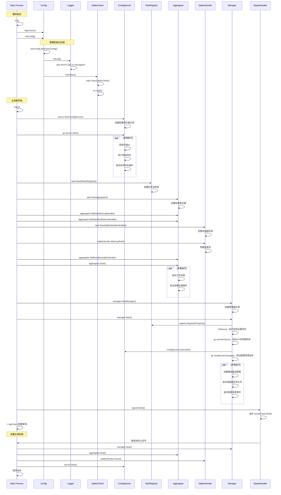

# Main.go 启动流程分析文档

本文档详细分析 `cmd/monitor/main.go` 的启动流程、组件调用关系和系统架构。

## 文件概览

`main.go` 是 Zabbix DDL Monitor 系统的主入口点，负责：
- 初始化配置、日志和 Zabbix 客户端
- 创建和启动核心组件
- 协调各组件的生命周期管理
- 处理优雅关闭

## 核心组件

### 全局变量
```go
var (
    zc         *zapix.ZabbixClient  // Zabbix API 客户端
    UserConfig *viper.Viper        // 配置管理器
    ConfPath   string              // 配置文件路径
)
```

### 主要组件
1. **ConfigSyncer** - 配置同步器，从 Zabbix API 获取专线配置
2. **TaskRegistry** - 任务注册表，管理可用的任务类型
3. **Aggregator** - 结果聚合器，收集和批量处理任务结果
4. **Manager** - 核心管理器，协调所有组件
5. **ZabbixSender** - Zabbix 数据发送器，将结果上报到 Zabbix

## 启动流程分析

### 时序图



### 详细流程说明

#### 1. 初始化阶段 (init函数)
```go
func init() {
    confPath := flag.String("c", "../conf/svr.yml", "ConfigPath")
    flag.Parse()
    ConfPath = *confPath
    initConfig()
}
```

**职责**：
- 解析命令行参数，获取配置文件路径
- 调用配置初始化函数

#### 2. 配置初始化 (initConfig函数)
```go
func initConfig() {
    // 1. 加载配置文件
    UserConfig, err = userconfig.NewUserConfig(userconfig.WithPath(ConfPath))
    
    // 2. 初始化日志系统
    initLog()
    
    // 3. 初始化 Zabbix 客户端
    initZabbix()
}
```

**职责**：
- 加载 YAML 配置文件
- 配置日志系统（硬编码路径：`../logs/ddl_monitor.log`）
- 创建并登录 Zabbix API 客户端

#### 3. 组件创建阶段 (main函数前半段)

##### 3.1 配置同步器创建
```go
syncer, err := syncer.NewConfigSyncer(zc, 10*time.Minute, proxyname)
go syncer.Start()
```

**ConfigSyncer 职责**：
- 通过 Zabbix API 定期获取专线配置
- 监控配置变更
- 提供配置订阅机制

##### 3.2 任务系统创建
```go
registry := task.NewDefaultRegistry()
aggregator := task.NewAggregator(5, 500, 15*time.Second)
```

**TaskRegistry 职责**：
- 管理可用的任务类型（如 PingTask）
- 提供任务发现和创建功能

**Aggregator 职责**：
- 收集任务执行结果
- 批量处理结果事件
- 分发结果到各个处理器

##### 3.3 结果处理器设置
```go
aggregator.AddHandler(&task.LogHandler{})      // 日志处理器
aggregator.AddHandler(&task.MetricsHandler{})  // 指标处理器

zabbixSender, err := task.NewZabbixSenderHandler(config)
aggregator.AddHandler(zabbixSender)             // Zabbix 发送器
```

**处理器类型**：
- **LogHandler**: 将结果写入日志
- **MetricsHandler**: 收集性能指标
- **ZabbixSenderHandler**: 将结果发送到 Zabbix Server/Proxy

#### 4. 核心管理器启动
```go
mgr := manager.NewManager(syncer, registry, aggregator)
mgr.Start()
```

**Manager 职责**：
- 注册 PingTask 到任务注册表
- 执行初始全量同步，发现现有专线配置
- 启动周期性全量同步（每4小时）
- 订阅配置变更事件并处理
- 管理路由器调度器的生命周期
- 处理专线的增删改操作

#### 5. 信号处理和优雅关闭
```go
sigChan := make(chan os.Signal, 1)
signal.Notify(sigChan, syscall.SIGINT, syscall.SIGTERM)
<-sigChan  // 阻塞等待信号

// 优雅关闭各组件
defer mgr.Stop()
defer aggregator.Stop()
defer zabbixSender.Close()
defer syncer.Stop()
```

**Manager.Start() 详细流程**：
1. **任务注册**: 将 PingTask 注册到任务注册表
2. **初始同步**: 调用 fullSync() 获取当前所有专线配置
3. **周期同步**: 启动后台协程，每4小时执行一次全量同步
4. **变更监听**: 订阅 ConfigSyncer 的变更事件，启动事件处理协程

**Aggregator.Start() 详细流程**：
1. **工作协程**: 启动5个工作协程处理结果事件
2. **缓冲管理**: 启动缓冲区管理协程，定时刷新缓冲区
3. **统计记录**: 记录初始统计信息和配置参数

## 组件交互关系

### 数据流向图

```
Zabbix API → ConfigSyncer → Manager → RouterScheduler → Task → Aggregator → ZabbixSender → Zabbix Proxy
     ↑                                      ↓                    ↑
     |                                 Connection Pool            |
     |                                      ↓                    |
     └─────────── 专线配置 ←──── Router ←─── SSH/Scrapli ←────────┘
```

### 组件依赖关系

1. **ConfigSyncer** 依赖：
   - Zabbix API 客户端
   - 代理名称配置

2. **Manager** 依赖：
   - ConfigSyncer (配置源)
   - TaskRegistry (任务管理)
   - Aggregator (结果处理)

3. **Aggregator** 依赖：
   - 多个 ResultHandler
   - ZabbixSender 配置

4. **ZabbixSender** 依赖：
   - Zabbix Proxy 连接信息
   - 连接池配置

## 配置参数说明

### 必需配置项
```yaml
server:
  log:
    applog:
      loglevel: 1                    # 日志级别

zabbix:
  username: "admin"                  # Zabbix 用户名
  password: "password"               # Zabbix 密码  
  serverip: "zabbix.example.com"     # Zabbix 服务器IP
  serverport: "80"                   # Zabbix 服务器端口
  proxyname: "proxy-01"              # 代理名称（用于主机发现）
  proxyip: "proxy.example.com"       # 代理IP（用于数据发送）
  proxyport: "10051"                 # 代理端口（用于数据发送）
```

### 系统参数（硬编码）
- **配置文件路径**: `../conf/svr.yml` (相对于可执行文件)
- **日志文件路径**: `../logs/ddl_monitor.log` (相对于可执行文件)
- **ConfigSyncer同步间隔**: 10分钟 (从Zabbix API获取配置)
- **Manager周期同步间隔**: 4小时 (全量同步所有专线)
- **聚合器参数**: 5个工作协程，500个事件缓存，15秒刷新间隔
- **ZabbixSender连接池**: 5个连接，预暖启动

## 错误处理机制

### 启动阶段错误处理
1. **配置加载失败** → 程序退出 (`os.Exit(-1)`)
2. **Zabbix登录失败** → 记录错误日志，继续运行
3. **组件创建失败** → 记录错误日志，程序返回

### 运行阶段错误处理
1. **配置同步失败** → 记录错误，等待下次同步
2. **任务执行失败** → 记录错误，继续处理其他任务
3. **结果发送失败** → 重试机制，降级处理

## 生命周期管理

### 启动顺序
1. 配置和日志初始化
2. Zabbix 客户端创建和登录
3. ConfigSyncer 启动（后台协程）
4. TaskRegistry 和 Aggregator 创建
5. ZabbixSender 创建和连接池预暖
6. Manager 启动和初始同步
7. 信号监听启动

### 关闭顺序
1. 接收终止信号
2. Manager 停止（停止所有调度器）
3. Aggregator 停止（处理剩余结果）
4. ZabbixSender 关闭（关闭连接池）
5. ConfigSyncer 停止（停止同步协程）
6. 程序退出

## 并发设计

### 协程使用
- **ConfigSyncer**: 独立协程进行定期同步
- **Aggregator**: 多个工作协程处理结果
- **Manager**: 监听配置变更的协程
- **RouterScheduler**: 每个路由器独立的调度协程

### 同步机制
- **WaitGroup**: 用于优雅关闭时等待协程结束
- **Context**: 用于协程间的取消信号传递
- **Channel**: 用于结果传递和信号通知
- **Mutex**: 用于共享状态的并发访问保护

## 监控和调试

### 日志输出
- 启动过程的关键步骤日志
- 组件状态变更日志
- 错误和警告日志
- 连接池统计信息

### 调试支持
- 环境变量 `DEBUG=on` 启用 Zabbix API 调试
- 详细的错误信息记录
- 组件健康状态检查

## 性能特征

### 资源使用
- **内存**: 主要用于配置缓存和结果缓冲
- **CPU**: 主要用于任务调度和结果处理
- **网络**: Zabbix API 调用和设备连接
- **文件**: 日志文件写入

### 扩展性考虑
- 支持大量专线的并发监控
- 连接池复用减少资源消耗
- 批量结果处理提高效率
- 可配置的并发参数

这个架构设计确保了系统的可靠性、可扩展性和可维护性，能够满足企业级专线监控的需求。