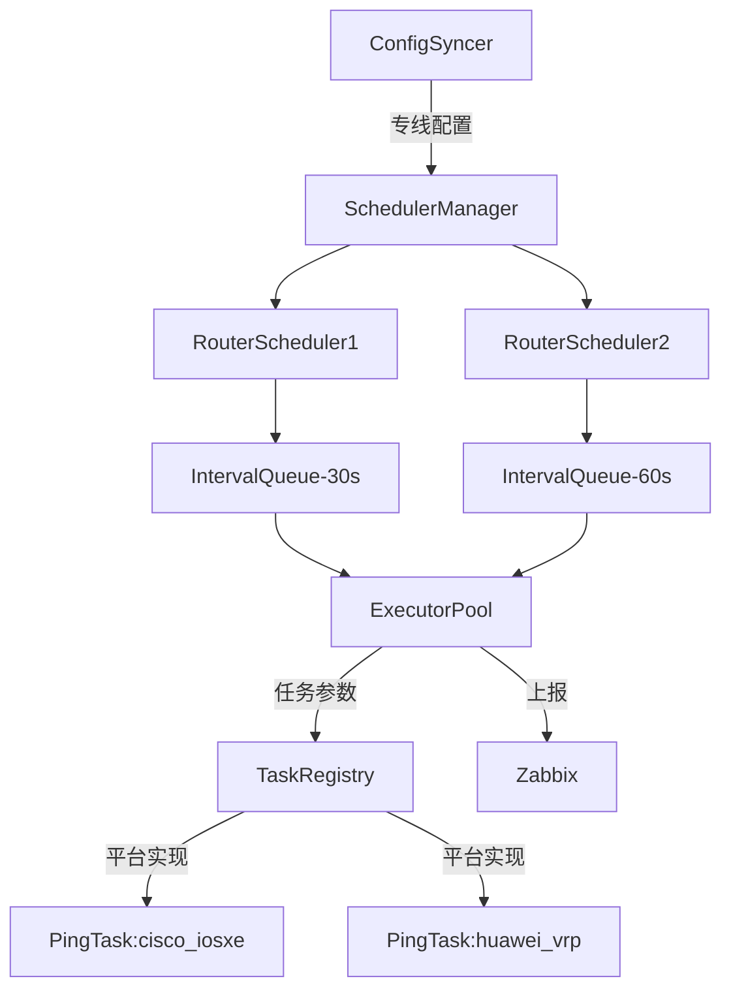

# 专线监控系统设计文档

## 1. 概述
本系统通过Zabbix实现网络专线通断监控，通过动态管理专线配置和路由器连接，实现多平台任务执行与批量结果上报的核心流程：
1. **配置同步**：从Zabbix API拉取专线配置，更新本地任务队列。
2. **任务调度**：按专线间隔执行路由器Ping检测，支持立即执行任务，复用路由器连接。
3. **结果上报**：批量汇总检测结果回传Zabbix。

## 2. 系统架构
### 2.1 架构图


### 2.2 核心模块
#### 配置同步模块（ConfigSyncer）
- 从Zabbix API获取专线配置（IP/间隔/路由器信息）。
- 维护动态专线列表。
- 配置变更时触发调度更新。
- 输出：`[]Line`（专线列表）。

#### 调度中心（SchedulerManager）
- 管理所有路由器的任务队列。

#### 路由器调度器（RouterScheduler）
- 维护路由器级别的任务队列（`IntervalQueue`/`ImmediateQueue`）。
- 合并相同间隔的任务。
- 支持两种调度模式：
  - **定时任务**：按配置间隔（30s/60s等）执行。
  - **即时任务**：高优先级立即执行。

#### 任务仓库（TaskRegistry）
- 任务实现注册中心。
- 提供任务发现接口。
- 提供平台适配器查询接口。
- 参数规范校验。

#### 执行引擎（ExecutorPool）
- 执行任务命令（连接复用）。
- 管理超时和重试。

## 3. 核心数据结构
### 专线配置
```go
type Line struct {
    ID       string
    IP       string
    Interval time.Duration
    Router   Router
}
```

### 路由器信息
```go
type Router struct {
    IP       string
    Username string
    Password string  // 加密存储
    Platform string  // 平台类型
}
```

### 任务结果
```go
type Result struct {
    Success bool
    Data    map[string]interface{}  // 指标数据（如延迟、丢包率）
    Error   *TaskError              // 错误详情（可选）
}
```

### 任务接口规范
```go
type Task interface {
    GenerateCommand(platform string, params map[string]interface{}) (string, error)
    ParseOutput(platform string, output string) (Result, error)
    ParamsSpec() []ParamSpec
}
type ParamSpec struct {
    Name     string                 // 参数名（如 "target_ip"）
    Type     string                 // 类型（"string"/"int"/"duration"）
    Required bool                   // 是否必填
    Default  interface{}            // 默认值
    Validate func(interface{}) error // 校验函数
}
```

### 平台适配实现
```go
type PlatformHandler interface {
    GenerateCommand(params map[string]interface{}) (string, error)
    ParseOutput(output string) (Result, error)
}

var platformHandlers = map[string]PlatformHandler{
    "cisco_iosxe": &CiscoPingHandler{},
    "huawei_vrp":  &HuaweiPingHandler{},
}
```

## 4. 任务生命周期
1. **参数校验**：调用 `ParamsSpec()` 校验输入参数。
2. **命令生成**：根据平台选择处理器，生成原始命令。
3. **结果解析**：调用处理器的 `ParseOutput` 方法。
4. **错误处理**：统一包装为 `TaskError`。

## 5. 错误处理
### 错误类型
```go
type TaskError struct {
    Code    string                 // 错误码（如 "INVALID_PARAMS"）
    Message string                 // 用户友好描述
    Details map[string]interface{} // 上下文信息
}
```

### 错误分类
| 错误类型         | 处理方式                 |
|------------------|--------------------------|
| 参数校验失败     | 拒绝任务并记录日志       |
| 平台不支持       | 标记失败并触发告警       |
| 执行超时         | 终止任务并释放连接       |

## 6. 测试方案
### 单元测试
- 参数校验逻辑。
- 命令生成器测试。
- 结果解析器测试。

### 集成测试
- 完整流程测试：
  1. 模拟Zabbix配置下发。
  2. 验证任务调度。
  3. 检查结果上报。

## 7. 扩展设计
### 新增平台支持
1. 实现平台Handler接口。
2. 注册到任务仓库。
3. 添加平台测试用例。

### 新增检测类型
1. 实现Task接口。
2. 定义参数规范。
3. 注册任务实现。
