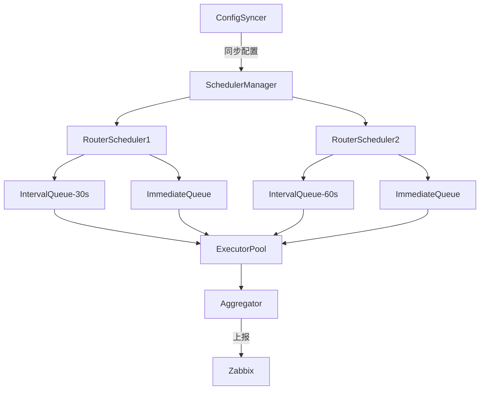

# Design: Line Monitoring

## Overview
通过动态管理专线配置和路由器连接，实现多平台任务执行与批量结果上报的核心流程如下：
1. **配置同步**：从 Zabbix API 拉取专线配置，更新本地任务队列
2. **任务调度**：按专线间隔调度任务，支持立即执行任务
3. **结果上报**：批量压缩检测结果并上报至 Zabbix

## Architecture


## Components

### RouterScheduler (核心调度器)
- **职责**：
  - 管理单个路由器的所有任务队列
  - 协调周期任务和立即任务的执行
- **队列类型**：
  - `IntervalTaskQueue`：按固定间隔触发任务
  - `ImmediateQueue`：立即执行的高优先级任务

### 任务调度规则
1. **周期任务**：
   - 根据专线配置的间隔自动分配到对应队列
   - 相同间隔的任务共享队列
   - 间隔必须是基础间隔的整数倍（如基础30s，则允许60s、90s）

2. **立即任务**：
   - 直接插入高优先级队列
   - 可以抢占周期任务的执行资源
   - 默认5秒超时

## Data Models
```go
// 专线配置
type Line struct {
    ID       string
    IP       string 
    Interval time.Duration
    Router   Router
}

// 路由器信息  
type Router struct {
    IP       string
    Username string
    Password string  // 加密存储
    Platform string  // 平台类型
}

// 任务结果
type TaskResult struct {
    Success bool
    Error   string
}
```

## 错误处理
- **间隔冲突**：拒绝非整数倍间隔的任务
- **队列满**：立即任务过多时拒绝新任务
- **执行超时**：终止长时间运行的任务

## 测试策略
1. **单元测试**：
   - 验证间隔队列的正确调度
   - 测试立即任务的抢占逻辑

2. **集成测试**：
   - 模拟完整任务生命周期（从配置同步到结果上报）
   - 验证多队列并发执行

3. **压力测试**：
   - 高负载下的队列稳定性
   - 混合任务类型的执行效率