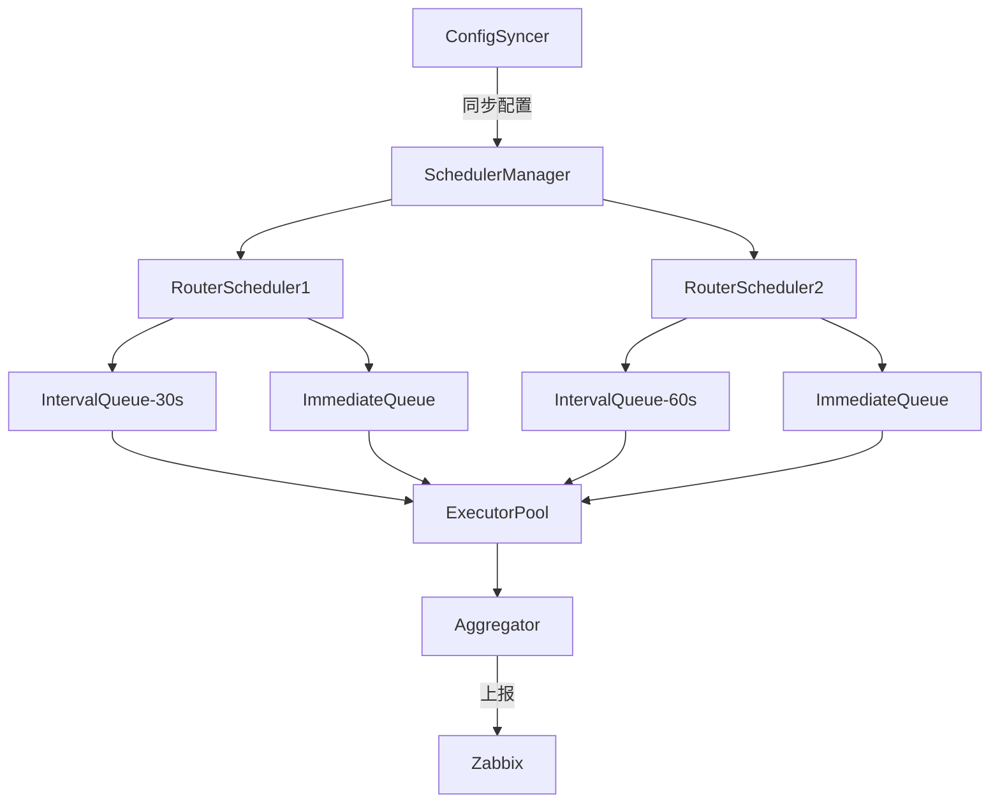

# Design: Line Monitoring

## Overview
通过动态管理专线配置和路由器连接，实现多平台任务执行与批量结果上报的核心流程如下：
1. **配置同步**：从 Zabbix API 拉取专线配置，更新本地任务队列。
2. **任务调度**：按专线间隔调度任务，支持任务合并与批量执行。
3. **结果上报**：批量压缩检测结果并上报至 Zabbix。

## Architecture


## Components

### RouterScheduler (核心调度器)
- **职责**：
  - 管理单个路由器的所有任务队列。
  - 协调周期任务和立即任务的执行。
  - 支持按间隔合并任务，减少连接开销。
  - 确保每个路由器独立调度。
- **队列类型**：
  - `IntervalTaskQueue`：按固定间隔触发任务，支持任务合并。
  - `ImmediateQueue`：立即执行的高优先级任务。

### 任务调度规则
1. **任务生成与合并**：
   - 每条专线生成一个独立任务（如 `Ping` 任务）。
   - 专线任务和路由器关联
   - 同一路由器的任务按间隔分组（如 `30s`、`60s`）。
   - 相同间隔的任务合并为一个批量任务，共享执行资源。

2. **执行优先级**：
   - 立即任务可抢占周期任务的执行资源。
   - 周期任务严格按间隔触发，避免资源竞争。

## Data Models
```go
// 专线配置
type Line struct {
    ID       string
    IP       string
    Interval time.Duration
    Router   Router
}

// 路由器信息
type Router struct {
    IP       string
    Username string
    Password string  // 加密存储
    Platform string  // 平台类型
}

// 任务结果
type TaskResult struct {
    Success bool
    Error   string
}
```

## 动态调整与错误处理
- **动态调整**：
  - 新增专线：自动创建或更新对应的 `IntervalTaskQueue`。
  - 移除专线：清理无效任务，释放资源。
- **错误处理**：
  - 间隔冲突：拒绝非整数倍间隔的任务。
  - 队列满：立即任务过多时拒绝新任务。
  - 执行超时：终止长时间运行的任务。

## 测试策略
1. **单元测试**：
   - 验证间隔队列的正确调度
   - 测试立即任务的抢占逻辑

2. **集成测试**：
   - 模拟完整任务生命周期（从配置同步到结果上报）
   - 验证多队列并发执行

3. **压力测试**：
   - 高负载下的队列稳定性
   - 混合任务类型的执行效率
