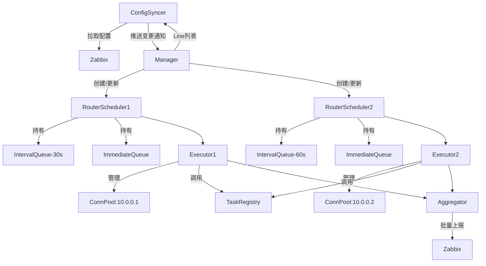
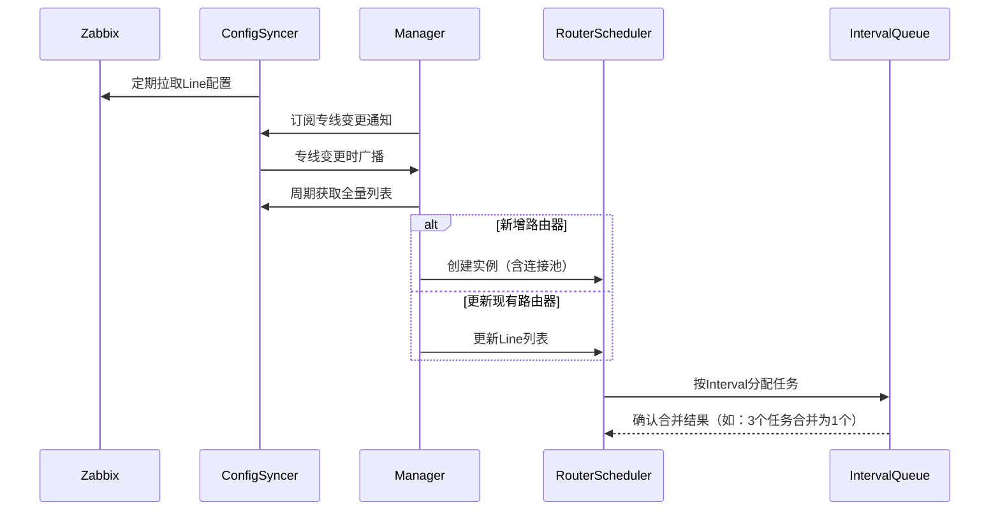
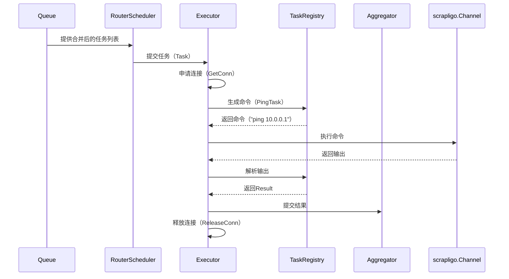

# 专线监控系统设计文档

## 1. 概述
本系统通过Zabbix实现网络专线通断监控，通过动态管理专线配置和路由器连接，实现多平台任务执行与批量结果上报的核心流程：
1. **配置同步**：从Zabbix API拉取专线列表。
2. **任务调度**：按专线间隔执行路由器Ping检测，支持立即执行任务，复用路由器连接。
3. **结果上报**：批量汇总检测结果回传Zabbix。

## 2. 系统架构与关键流程
### 2.1 架构图


### 2.2 核心模块

#### 配置同步模块（ConfigSyncer）
- 周期性的从Zabbix API获取专线配置（IP/间隔/路由器信息）。
- 周期可自定义，默认5m
- 提供专线列表查询接口，用于查询当前所有专线列表。
- 提供专线变更通知接口，把专线的增删改通知给订阅者。

#### 调度中心（Manager）
- 周期性的从ConfigSyncer获取全量专线列表
- 订阅ConfigSyncer的专线变更通知
- 维护动态专线列表（初始化时从ConfigSyncer获取全量、收到ConfigSyncer通知后更新，周期性的获取从ConfigSyncer获取全量纠正，放在异常，周期为1小时）
- 根据专线列表管理路由器信息缓存（包含路由器信息及路由器上绑定的专线数量）
- 管理所有RouterScheduler创建(启动时、收到专线新增时按需创建，根据全量列表周期检查？)
- 路由器上绑定的专线数量为零时延迟删除RouterScheduler(10分钟),如果在延迟期间有新的专线关联上，则取消延迟删除
- 专线变更信息通知到相应的RouterScheduler,RouterScheduler收到通知后更新自身信息

#### 路由器调度器（RouterScheduler）
- （`IntervalQueue`/`ImmediateQueue`）生成任务
- 维护路由器级别的任务队列（`IntervalQueue`/`ImmediateQueue`）。
- 更新Line信息
- IntervalQueue里的任务合并。
- IntervalQueue定时触发任务。
- 触发任务分发至 `Executor`。

#### 执行器 （Executor）
- **职责**：
  - 管理路由器连接池（`ConnPool`），负责连接的申请、释放和健康检查
  - 调用 `TaskRegistry` 生成和解析命令
  - 控制任务超时（默认30秒）和重试（最多3次）
  - 定期清理无效连接（健康检查周期：5分钟）
- **健康检查**：每5分钟扫描 `ConnPool`，清理无效连接
- **超时控制**：单任务默认超时30秒，超时后强制释放连接


#### 任务仓库（TaskRegistry）
- 任务实现注册中心。
- 提供任务发现接口。
- 提供平台适配器查询接口。
- 参数规范校验。

#### 监控任务实现 （ping_task）
- 支持多平台（`cisco_iosxe`、`cisco_iosxr`、`cisco_nxos`、`h3c_comware`、`huawei_vrp`)
- 支持scrapligo和channel
- 支持命令合并

#### 结果上报 （aggregator）
- 合并结果并上报
- 触发上报条件
  - 缓冲区达到 100 条结果，或
  - 最近一次上报后超过 5 秒。


### 2.3 关键时序流程
#### 配置同步时序


#### 任务执行时序



## 3. 核心数据结构
### 专线配置
```go
type Line struct {
    ID       string
    IP       string
    Interval time.Duration
    Router   Router
    	Hash     uint64 // Line信息的hash，用于比对是否有变化
}
var DefaultInterval time.Duration = 3 * time.Minute
```

### 路由器信息
```go
type Router struct {
	ID       string
    IP       string
    Username string
    Password string  // 加密存储
    Platform string  // 平台类型
}
```

### 管理器（Manager）
```go
type Manager struct {
	configSyncer *syncer.ConfigSyncer
	schedulers   map[string]*scheduler.RouterScheduler // key: routerIP
	routerCache  map[string]*connection.Router   // 路由器信息缓存
	mu           sync.Mutex
}
```
### 配置同步器 (ConfigSyncer)
// 引用github.com/charlesren/zapix
```go
type ConfigSyncer struct {
    client       *zapix.ZabbixClient
    lines       map[string]Line  // 当前全量配置
    version     int64           // 单调递增版本号
    subscribers []Subscriber    // 订阅者列表
    mu          sync.RWMutex    // 读写锁替代互斥锁
	syncInterval time.Duration
    lastSyncTime time.Time // 记录最后一次同步时间
    ctx context.Context
   	cancel       context.CancelFunc
	stopOnce     sync.Once
	stopped      bool
}
type Subscriber chan<- LineChangeEvent  // 强类型的只写通道
const (
    LineCreate ChangeType = iota + 1
    LineUpdate
    LineDelete
)
type LineChangeEvent struct {
    Type    ChangeType
    Line   Line
}
```

### 路由器调度器（RouterScheduler）
```go
type IntervalQueue struct {
    Tasks     []Task          // 待执行任务列表（按间隔分组）
   	Interval time.Duration
	Lines    []*config.Line
	NextRun  time.Time
	Mu       sync.Mutex
	Timer    *time.Ticker    // 调度触发器
}
type RouterScheduler struct {
	Router     *connection.Router
	Connection *connection.Connection
	Queues     map[time.Duration]*IntervalQueue
	CloseChan  chan struct{}
	WG         sync.WaitGroup
	Mu         sync.Mutex
}


type Executor struct {
    ConnPool    map[string]scrapligo.Channel // key: Router.IP
    Mu          sync.Mutex                   // 连接池并发锁
    TaskTimeout time.Duration                // 单任务超时时间
    Scheduler   *RouterScheduler             // 反向引用，用于队列交互
}
@@ -Executor的执行逻辑-
func (e *Executor) RunTask(task Task) {
    conn := e.GetConn(task.RouterIP)
    driver, err := conn.Get() // 获取scrapligo驱动
    response, err := driver.SendInteractive(task.Events) // 执行交互式命令
}

```


### 任务接口规范
```go
type Task interface {
    GenerateCommand(platform string, params map[string]interface{}) (string, error)
    ParseOutput(platform string, output string) (Result, error)
    ParamsSpec() []ParamSpec
}
type ParamSpec struct {
    Name     string                 // 参数名（如 "target_ip"）
    Type     string                 // 类型（"string"/"int"/"duration"）
    Required bool                   // 是否必填
    Default  interface{}            // 默认值
    Validate func(interface{}) error // 校验函数
}
```

### 平台适配实现
```go
type PlatformHandler interface {
    GenerateCommand(params map[string]interface{}) (string, error)
    ParseOutput(output string) (Result, error)
}

var platformHandlers = map[string]PlatformHandler{
    "cisco_iosxe": &CiscoPingHandler{},
    "huawei_vrp":  &HuaweiPingHandler{},
}
type CiscoIOSXEHandler struct {
   DefaultEvents []*scrapligo.Event // 预定义交互事件
}

func (h *CiscoIOSXEHandler) GenerateCommand(params map[string]interface{}) ([]*scrapligo.Event, error) {
  return h.DefaultEvents, nil // 返回scrapligo事件序列
}


```
### 注册任务
- 通过 `init()` 函数在模块加载时注册任务：
```go
type Registry struct {
	mu    sync.RWMutex
	tasks map[string]Task
}
// Register adds a new task implementation to the registry
func (r *Registry) Register(name string, t Task) error {
  r.tasks[name] = t
}
init(){
	//todo
}

```

### 任务结果
```go
type Result struct {
    Success bool
    Data    map[string]interface{}  // 指标数据（如延迟、丢包率）
    Error   *TaskError              // 错误详情（可选）
}
type BatchResult struct {
    Timestamp  time.Time         // 批次时间戳
    Results    []Result          // 合并后的检测结果
    RouterID   string            // 路由器标识（用于溯源）
}
```


## 4.数据流与错误处理


### 4.1 正常流程
1. **连接申请**：
   - `Executor` 从 `ConnPool` 获取连接，若不存在则新建并缓存。
2. **命令生成**：
   - 调用 `TaskRegistry.GenerateCommand()`，传入平台类型和参数（如 `{IP: "10.0.0.1"}`）。
3. **结果解析**：
   - 原始输出通过 `TaskRegistry.ParseOutput()` 转换为统一 `Result` 格式。


### 错误处理
```go
type TaskError struct {
    Code    string                 // 错误码（如 "INVALID_PARAMS"）
    Message string                 // 用户友好描述
    Details map[string]interface{} // 上下文信息
}
```
| 错误类型         | 处理方式                 |
|------------------|--------------------------|
| 连接申请失败     | 标记任务失败，触发告警并重试（最多3次）。 |
| 参数校验失败     | 拒绝任务并记录日志       |
| 平台不支持       | 标记失败并触发告警       |
| 执行超时         | 终止任务并释放连接       |
| 上报失败         | 本地缓存结果，下次批次重试（最多3次） |


## 5. 测试方案
### 单元测试
- 参数校验逻辑。
- 命令生成器测试。
- 结果解析器测试。

### 集成测试
- 完整流程测试：
  1. 模拟Zabbix配置下发。
  2. 验证任务调度。
  3. 检查结果上报。

## 6. 扩展设计
### 新增平台支持
1. 实现平台Handler接口。
2. 注册到任务仓库。
3. 添加平台测试用例。

### 新增检测类型
1. 实现Task接口。
2. 定义参数规范。
3. 注册任务实现。
