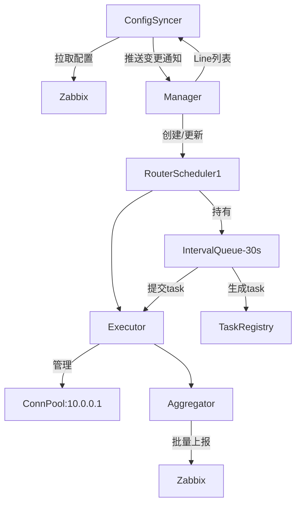
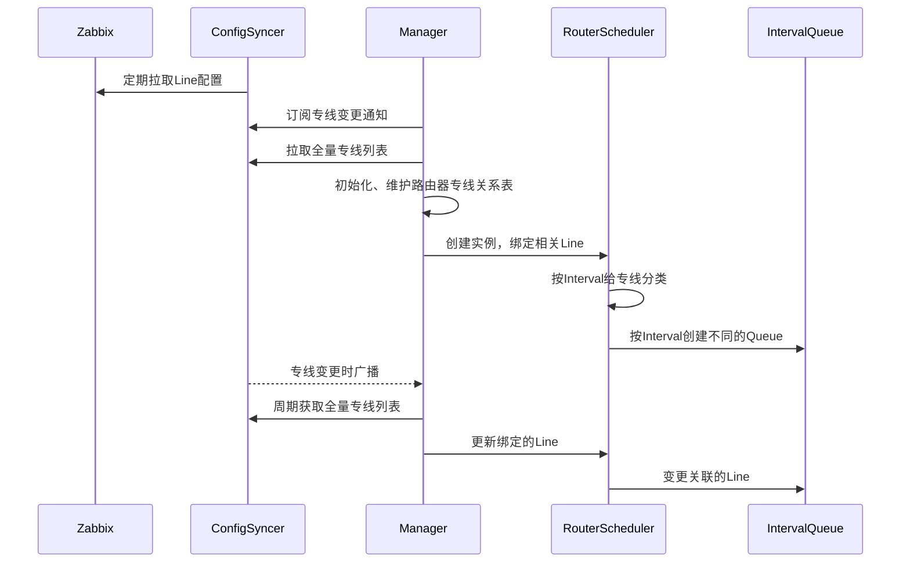
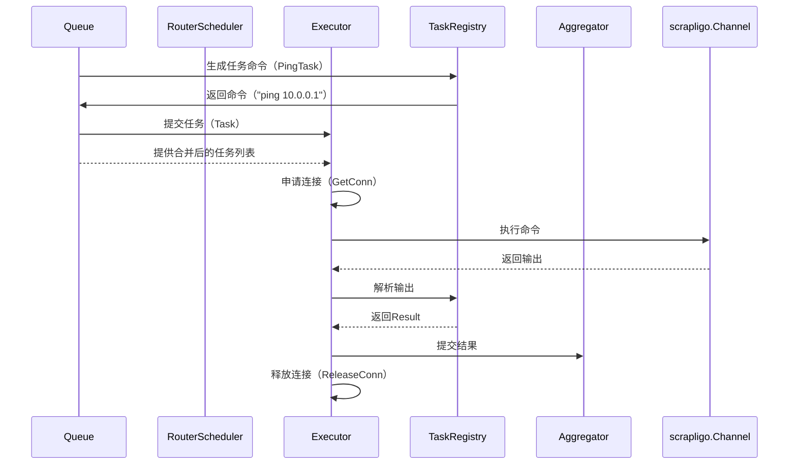

# 专线监控系统设计文档

## 1. 概述
本系统通过Zabbix实现网络专线通断监控，通过动态管理专线配置和路由器连接，实现多平台任务执行与批量结果上报的核心流程：
1. **配置同步**：从Zabbix API拉取专线列表。
2. **任务调度**：按专线间隔执行路由器Ping检测，支持立即执行任务，复用路由器连接。
3. **结果上报**：批量汇总检测结果回传Zabbix。

## 2. 系统架构与关键流程
### 2.1 架构图


### 2.2 核心模块

#### 配置同步模块（ConfigSyncer）
- 周期性的从Zabbix API获取专线配置（IP/间隔/路由器信息）。
- 周期可自定义，默认5m
- 提供专线列表查询接口，用于查询当前所有专线列表。
- 提供专线变更通知接口，把专线的增删改通知给订阅者。

#### 调度中心（Manager）
- 周期性的从ConfigSyncer获取全量专线列表
- 订阅ConfigSyncer的专线变更通知
- 维护动态路由器专线关系表,描述路由器上绑定的专线,可计算出路由器上绑定的专线数量，同时隐含的知道了路由器信息，因为每条专线上都有（初始化时从ConfigSyncer获取全量、收到ConfigSyncer通知后更新，周期性的获取从ConfigSyncer获取全量纠正，放在异常，周期为1小时）
- 管理所有RouterScheduler创建(启动时、收到专线新增时按需创建，根据全量列表周期校准)
- 路由器上绑定的专线数量为零时延迟删除RouterScheduler(10分钟),如果在延迟期间有新的专线关联上，则取消延迟删除
- 专线变更信息通知到相应的RouterScheduler,RouterScheduler收到通知后更新自身信息

#### 路由器调度器（RouterScheduler）
- 更新Line信息
- 维护路由器级别的任务队列（`IntervalQueue`/`ImmediateQueue`）。
- 收到任务信号分发至 `Executor`。
  - 管理路由器连接池（`ConnPool`），负责连接的申请、释放和健康检查
  - 连接处支持多协议ssh/netconf/scrapli
  - 定期清理无效连接（健康检查周期：5分钟）

  #### 路由器任务队列（IntervalQueue)
- IntervalQueue定时触发任务。
- 维护相同interval的line列表

#### 执行器 （Executor）
- **职责**：
  - 控制任务超时（默认30秒）和重试（最多3次）
- 生成任务
- IntervalQueue里的任务合并。
  - 执行任务
  - 提交任务结果到aggregator
- **健康检查**：每5分钟扫描 `ConnPool`，清理无效连接
- **超时控制**：单任务默认超时30秒，超时后强制释放连接


#### 异步执行器
- **职责**：非阻塞执行任务，通过通道提交和返回结果。
- **组合设计**：
  - 内部复用同步`TaskExecutor`逻辑。
  - 通过`workers`控制并发度。
  - 默认 `workers`: 10
  - 任务队列容量: 100
  - 单路由器最大并发连接数: 3（防止单个路由器过载）

#### 任务仓库（TaskRegistry）
- 任务实现注册中心。
- 提供任务发现接口。
- 提供平台适配器查询接口。
- 参数规范校验。
- 任务接口分为基础接口和可选批量接口用来支持常规命令，和批量合并的命令
- 当任务不支持批量时，自动降级为单任务执行
- 任务注册时需声明是否支持批量合并（如通过`Registry.RegisterBatch`）。
- 任务结果解析


#### 监控任务实现 （ping_task）
- 支持多平台（`cisco_iosxe`、`cisco_iosxr`、`cisco_nxos`、`h3c_comware`、`huawei_vrp`)
- 支持scrapligo和channel
- 支持命令合并

#### 结果上报 （aggregator）
- 合并结果并上报
- 触发上报条件
  - 缓冲区达到 100 条结果，或
  - 最近一次上报后超过 5 秒。


### 2.3 关键时序流程
#### 配置同步时序


#### 任务执行时序



#### 异步执行流程
```mermaid
sequenceDiagram
    participant Scheduler as RouterScheduler
    participant AsyncExec
    participant Pool as ConnectionPool
    participant Aggregator

    Scheduler->>AsyncExec: Submit(TaskRequest)
    AsyncExec->>Pool: GetConnection(router.IP)
    Pool-->>AsyncExec: ProtocolDriver
    AsyncExec->>ProtocolDriver: SendCommands(batch)
    ProtocolDriver-->>AsyncExec: Raw Output
    AsyncExec->>Aggregator: Report(Result)


sequenceDiagram
    participant Queue as IntervalTaskQueue
    participant Scheduler as RouterScheduler
    participant Executor
    participant Pool as ConnectionPool

    Note over Queue: 定时触发（如30秒）
    Queue->>Scheduler: 发送execNotify信号
    Scheduler->>Pool: 获取连接（GetWithRetry）
    Pool-->>Scheduler: 返回Connection
    Scheduler->>Executor: ExecuteWithConn(conn, tasks)
    Executor->>Pool: 使用连接执行命令
    Executor-->>Scheduler: 返回Result[]
    Scheduler->>Aggregator: 上报结果
    Scheduler->>Pool: 释放连接


###  任务合并规则
1. **可合并条件**：
   - 相同路由器平台（如 `cisco_iosxe`）。
   - 相同任务类型（如均为 `PingTask`）。
   - 参数兼容（如 `repeat` 和 `timeout` 值相同）。
2. **合并策略**：
   - 批量生成命令（如 `ping ip1 ip2 ip3`）。
   - 解析输出时按顺序拆分结果。
3. **Fallback**：若任务未实现 `BatchTask`，自动降级为单任务模式。


## 3. 核心数据结构
### 专线配置
```go
type Line struct {
    ID       string
    IP       string
    Interval time.Duration
    Router   Router
    	Hash     uint64 // Line信息的hash，用于比对是否有变化
}
var DefaultInterval time.Duration = 3 * time.Minute
```

### 路由器信息
```go
type Router struct {
	ID       string
    IP       string
    Username string
    Password string  // 加密存储
    Platform string  // 平台类型
    Protocol string  // "scrapli channel" "ssh" 或 "netconf"
}
```

### 管理器（Manager）
```go
type Manager struct {
	configSyncer *syncer.ConfigSyncer
	schedulers   map[string]Scheduler     // key: routerIP
	routerLines  map[string][]syncer.Line // key: routerIP
	mu           sync.Mutex
	stopChan     chan struct{}
	wg           sync.WaitGroup
}
```
### 配置同步器 (ConfigSyncer)
// 引用github.com/charlesren/zapix
```go
type ConfigSyncer struct {
    client       *zapix.ZabbixClient
    lines       map[string]Line  // 当前全量配置
    version     int64           // 单调递增版本号
    subscribers []chan<- LineChangeEvent    // 订阅者列表
    mu          sync.RWMutex    // 读写锁替代互斥锁
	syncInterval time.Duration
    lastSyncTime time.Time // 记录最后一次同步时间
    ctx context.Context
   	cancel       context.CancelFunc
	stopOnce     sync.Once
	stopped      bool
}
const (
    LineCreate ChangeType = iota + 1
    LineUpdate
    LineDelete
)
type LineChangeEvent struct {
    Type    ChangeType
    Line   Line
}
// Events 返回只读通道供用户使用
func (s *Subscription) Events() <-chan LineChangeEvent {
	return s.events
}
type Subscription struct {
	events chan LineChangeEvent // 内部使用双向通道
	cs     *ConfigSyncer
	cancel context.CancelFunc
	once   sync.Once
}
```

### 路由器调度器（RouterScheduler）
```go
type IntervalQueue struct {
    Tasks     []Task          // 待执行任务列表（按间隔分组）
   	Interval time.Duration
	Lines    []*config.Line
	NextRun  time.Time
	Mu       sync.Mutex
	Timer    *time.Ticker    // 调度触发器
}
type RouterScheduler struct {
	Router     *connection.Router
	Connection *connection.Connection
	Queues     map[time.Duration]*IntervalQueue
	CloseChan  chan struct{}
	WG         sync.WaitGroup
	Mu         sync.Mutex
}

type Scheduler interface {
	OnLineCreated(line syncer.Line)     // 专线创建
	OnLineUpdated(old, new syncer.Line) // 专线更新（提供新旧值）
	OnLineDeleted(line syncer.Line)     // 专线删除
	OnLineReset(lines []syncer.Line)    // 专线重置
	Stop()
	Start()
}
```
### 执行器
```go
type Executor struct {
    ConnPool    map[string]scrapligo.Channel // key: Router.IP
    Mu          sync.Mutex                   // 连接池并发锁
    TaskTimeout time.Duration                // 单任务超时时间
    Scheduler   *RouterScheduler             // 反向引用，用于队列交互
}
@@ -Executor的执行逻辑-
func (e *Executor) RunTask(task Task) {
    conn := e.GetConn(task.RouterIP)
    driver, err := conn.Get() // 获取scrapligo驱动
    response, err := driver.SendInteractive(task.Events) // 执行交互式命令
}
```
### 异步执行器
```go
 **任务队列满时的拒绝策略**（阻塞等待或直接丢弃)
```
### 连接池
```go
type ConnectionPool interface {
    Get(routerIP string, protocol string) (ProtocolDriver, error)
    Release(driver ProtocolDriver)
}
type ProtocolDriver interface {
    SendCommands(commands []string) (string, error)
    Close() error
}

// SSH实现（包装scrapligo）
type SSHDriver struct {
    channel *scrapligo.Channel
}

// NETCONF实现（示例）
type NETCONFDriver struct {
    session netconf.Session
}

// 连接池获取示例（自动选择协议）
driver, err := pool.Get(ctx, router.IP, router.Protocol)
```


### 任务接口规范
```go
type Task interface {
    GenerateCommands(platform string, params map[string]interface{}) ([]*channel.SendInteractiveEvent, error)
    Execute(platform string, conn *connection.Connection, params map[string]interface{}) (Result, error)
    ParseOutput(platform string, output string) (Result, error)
    ParamsSpec() []ParamSpec
}

// 可选批量任务接口
type BatchTask interface {
    Task
    GenerateBatchCommands(platform string, params []map[string]interface{}) ([]*channel.SendInteractiveEvent, error)
}

//ParamSpec用于参数校验，与 `Registry` 交互
type ParamSpec struct {
    Name     string                 // 参数名（如 "target_ip"）
    Type     string                 // 类型（"string"/"int"/"duration"）
    Required bool                   // 是否必填
    Default  interface{}            // 默认值
    Validate func(interface{}) error // 校验函数
}

```

### 平台适配实现
```go
type PlatformHandler interface {
    GenerateCommand(params map[string]interface{}) (string, error)
    ParseOutput(output string) (Result, error)
}

var platformHandlers = map[string]PlatformHandler{
    "cisco_iosxe": &CiscoPingHandler{},
    "huawei_vrp":  &HuaweiPingHandler{},
}
type CiscoIOSXEHandler struct {
   DefaultEvents []*scrapligo.Event // 预定义交互事件
}

func (h *CiscoIOSXEHandler) GenerateCommand(params map[string]interface{}) ([]*scrapligo.Event, error) {
  return h.DefaultEvents, nil // 返回scrapligo事件序列
}


```
### 注册任务
- 通过 `init()` 函数在模块加载时注册任务：
```go
type Registry struct {
	mu    sync.RWMutex
	tasks map[string]Task
}
// Register adds a new task implementation to the registry
func (r *Registry) Register(name string, t Task) error {
  r.tasks[name] = t
}
func (r *Registry) RegisterBatch(name string, t Task) error {
  r.tasks[name] = t
}
init(){
	//todo
}

//registry.RegisterBatch("ping", &PingTask{})  // 明确支持批量
//registry.Register("config", &ConfigTask{})   // 仅单任务

```

### 任务结果
```go
type Result struct {
    Success bool
    Data    map[string]interface{}  // 指标数据（如延迟、丢包率）
    Error   *TaskError              // 错误详情（可选）
}
type BatchResult struct {
    Timestamp  time.Time         // 批次时间戳
    Results    []Result          // 合并后的检测结果
    RouterID   string            // 路由器标识（用于溯源）
}
```


## 4.数据流与错误处理


### 4.1 正常流程
1. **连接申请**：
   - `Executor` 从 `ConnPool` 获取连接，若不存在则新建并缓存。
2. **命令生成**：
   - 调用 `TaskRegistry.GenerateCommand()`，传入平台类型和参数（如 `{IP: "10.0.0.1"}`）。
3. **结果解析**：
   - 原始输出通过 `TaskRegistry.ParseOutput()` 转换为统一 `Result` 格式。


### 错误处理
```go
type TaskError struct {
    Code    string                 // 错误码（如 "INVALID_PARAMS"）
    Message string                 // 用户友好描述
    Details map[string]interface{} // 上下文信息
}
```
| 错误类型         | 处理方式                 |
|------------------|--------------------------|
| 连接申请失败     | 标记任务失败，触发告警并重试（最多3次）。 |
| 参数校验失败     | 拒绝任务并记录日志       |
| 平台不支持       | 标记失败并触发告警       |
| 执行超时         | 终止任务并释放连接       |
| 上报失败         | 本地缓存结果，下次批次重试（最多3次） |


## 5. 测试方案
### 单元测试
- 参数校验逻辑。
- 命令生成器测试。
- 结果解析器测试。

### 集成测试
- 完整流程测试：
  1. 模拟Zabbix配置下发。
  2. 验证任务调度。
  3. 检查结果上报。

## 6. 扩展设计
### 新增平台支持
1. 实现平台Handler接口。
2. 注册到任务仓库。
3. 添加平台测试用例。

### 新增检测类型
1. 实现Task接口。
2. 定义参数规范。
3. 注册任务实现。
