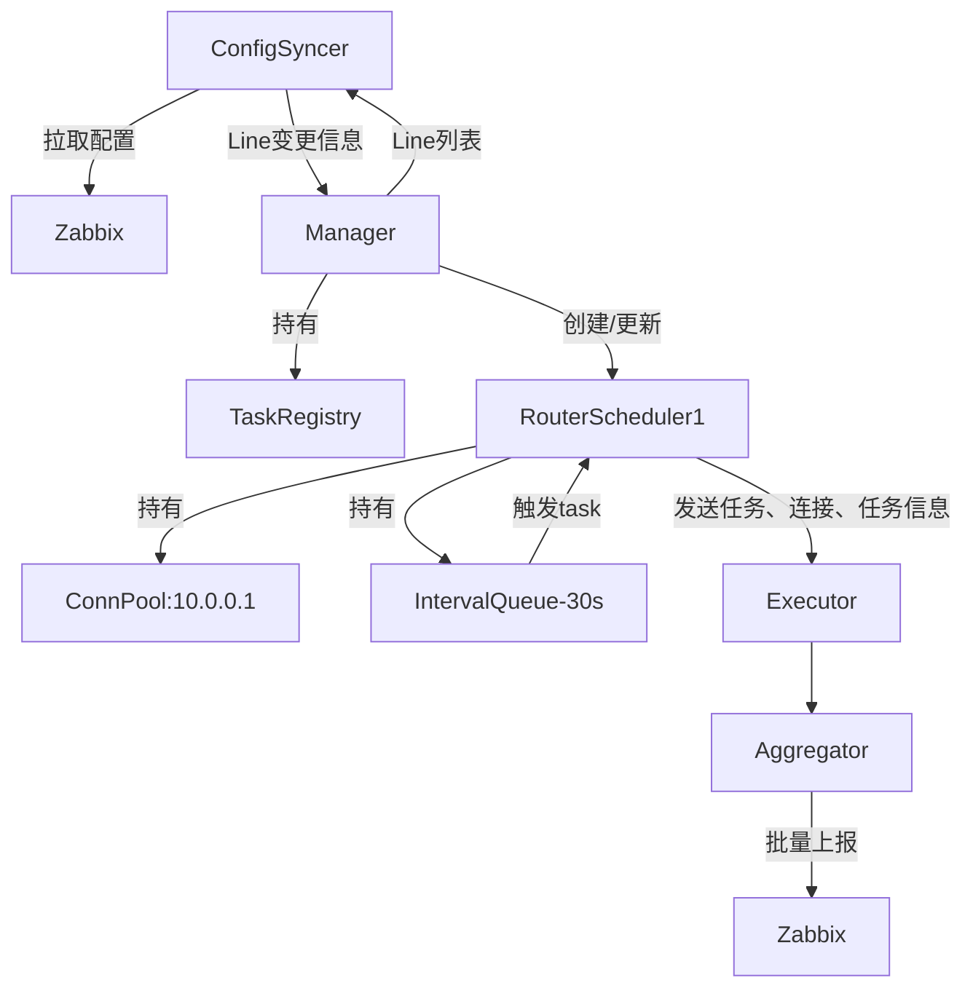
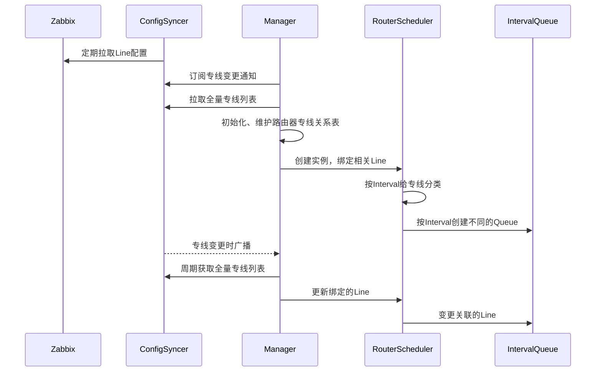
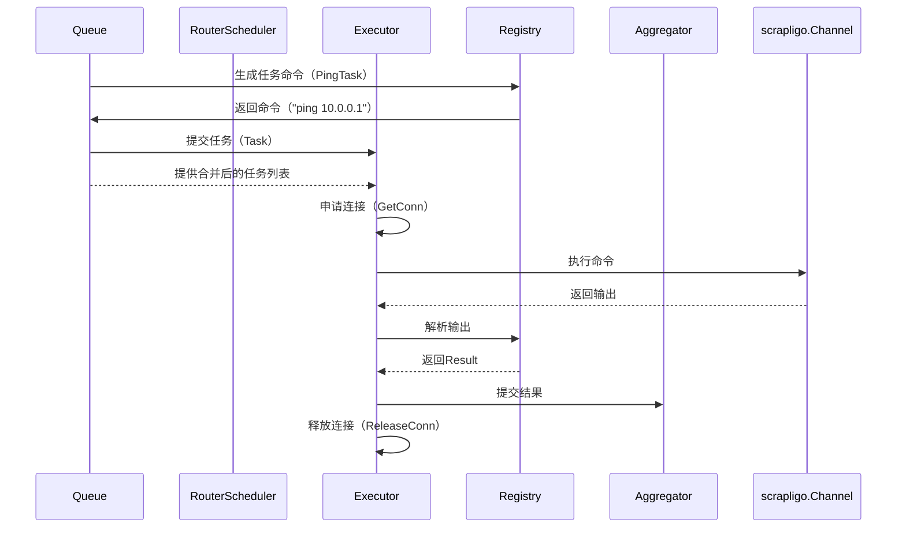

# 专线监控系统设计文档

## 1. 概述
本系统通过Zabbix实现网络专线通断监控，通过动态管理专线配置和路由器连接，实现多平台任务执行与批量结果上报的核心流程：
1. **配置同步**：从Zabbix API拉取专线列表。
2. **任务调度**：按专线间隔执行路由器Ping检测，复用路由器连接。
3. **结果上报**：批量汇总检测结果回传Zabbix。

## 2. 系统架构与关键流程
### 2.1 架构图


### 2.2 核心模块

#### 配置同步模块（ConfigSyncer）
- 周期性的从Zabbix API获取专线配置（IP/间隔/路由器信息）。
- 周期可自定义，默认5m
- 提供专线列表查询接口，用于查询当前所有专线列表。
- 提供专线变更通知接口，把专线的增删改通知给订阅者。

#### 调度中心（Manager）
- 周期性的从ConfigSyncer获取全量专线列表
- 订阅ConfigSyncer的专线变更通知
- 维护动态路由器专线关系表,描述路由器上绑定的专线,可计算出路由器上绑定的专线数量，同时隐含的知道了路由器信息，因为每条专线上都有（初始化时从ConfigSyncer获取全量、收到ConfigSyncer通知后更新，周期性的获取从ConfigSyncer获取全量纠正，放在异常，周期为1小时）
- 管理所有RouterScheduler创建(启动时、收到专线新增时按需创建，根据全量列表周期校准)
- 路由器上绑定的专线数量为零时延迟删除RouterScheduler(10分钟),如果在延迟期间有新的专线关联上，则取消延迟删除
- 专线变更信息通知到相应的RouterScheduler,RouterScheduler收到通知后更新自身信息
- 管理任务注册中心TaskRegistry
- 在启动时注册了 `PingTask`任务。

#### 路由器调度器（RouterScheduler）
- 更新绑定到自身Line信息
- 维护路由器级别的任务队列（`IntervalQueue`）。
- 收到任务信号分发至 `Executor`。
- 拥有connectPool
- 调度PingTask类型的任务，任务的触发时机由IntervalQueue决定
- 从ConnectionPool申请连接、用完释放
- 根据Router里Protocol信息，申请相应的协议的连接
- Router里自带platform信息，用于匹配task实现的平台类型
- 根据任务类型（PingTask）以及router的协议类型、平台类型,利用任务注册中心里PingTask的信息生成任务，确保task命令类型与驱动匹配.优先选择Iteractive_event，其次选择commands.

#### 路由器任务队列（IntervalQueue)
  周期性的提供line列表，便于生成task(作为task的一个参数)
- IntervalQueue根据检查间隔定时触发任务。
- 维护相同interval的line列表
- 专线变化时动态调整、迁移。


#### 连接池 （ConnectionPool）
- 保存协议的类型：源头是Router,由用户指定，在创建RouterScheduler时传到ConnectionPool作为自身的一个参数
- 根据协议类型维护管理相应的连接
- 需支持多协议类型ssh/netconf/scrapli连接
- 负责连接的创建、关闭、健康检查
- 提供protocoldriver的实例化和缓存，返回增强驱动
- 通过工厂模式创建不同的ProtocolDriver，便于扩展其它协议类型
- 实现连接池预热功能，根据router绑定的协议类型，初始化连接,支持初始话连接的数量可调
- 缓存router绑定的协议类型的连接的capability
- 空闲连接自动清理
- 心跳保活


#### 协议驱动（ProtocolDriver）
- 实现协议原生操作（如ssh命令发送，scrapli交互）
- 包括同样的基本方法，如Close,返回driver的协议类型的方法


#### 任务（Task）
Task 仅定义参数规范，实际工作由适配器完成
- 每一类任务都能返回支持的协议类型如ssh/scrapli,以及协议下命令的类型如interactive_event/commands，此外还有命令类型下支持的平台如cisco_iosxe、huawei_vrp
- 使用者提供协议类型、平台类型，不关心命令类型
- 任务开发者知道命令类型，为协议和平台提供任务实现
- 任务的实现可能支持多平台，如cisco_iosxe、huawei_vrp
- 任务执行前进行Platform/Protocol/CommandType匹配性校验和参数规范性校验

##### 任务注册中心TaskRegistry）
注册和发现适配器实例
- 提供注册接口注册实现的任务类型
- 有一个注册中心，存储所有实现的各任务类型。
- 提供任务发现接口。
- 提供平台适配器查询接口。


##### 任务实现
- 声明支持的协议类型（如ssh/netconf/scrapli）
- 实现任务逻辑，与协议驱动匹配
- TaskType>Platform>Protocol>CommandType>TaskImpl依次递进的层级结构
- 协议可支持多种命令类型，如interactive_event/commands
- 可以有平台抽象层屏蔽平台差异，实现平台无关的命令逻辑
- 当前scrapli实现interactive_event和commands类型
- 当前ssh实现commands类型

##### 监控任务实现 （ping_task）
- 支持多平台（`cisco_iosxe`、`cisco_iosxr`、`cisco_nxos`、`h3c_comware`、`huawei_vrp`)
- 支持scrapligo和channel
- 支持多条专线的IP合并为一个参数，一次性检查

##### 平台适配器（PlatformAdapter）
- 将通用任务参数转换为设备特定的协议指令
- 封装不同厂商设备的特殊处理逻辑


##### 执行器 （Executor）
负责执行已生成的任务实例，专注协议驱动交互与流程控制,依赖外部传入的连接和任务
获取适配器 → 生成命令 → 提交到protocolDriver
- 参数规范性校验
- 保障协议driver的类型与task的实现匹配
- 保障task的实现支持当前的platform
- 提交任务到ProtocolDriver，执行任务
- 控制任务超时（默认30秒）和重试（最多3次）#最好放到Executor外面,由调用者控制
- 提交任务结果到aggregator
- 任务结果解析 #暂不实施，返回rawOutput,用户自行解析


#### 异步执行器 （asyncExecutor）
- **职责**：非阻塞执行任务，通过通道提交和返回结果。
- **组合设计**：
  - 内部复用同步`Executor`逻辑。
  - 通过`workers`控制并发度。
  - 默认 `workers`: 10
  - 任务队列容量: 100
  - 单路由器最大并发连接数: 3（防止单个路由器过载）


#### 结果上报 （aggregator）
- 合并结果并上报
- 触发上报条件
  - 缓冲区达到 100 条结果，或
  - 最近一次上报后超过 5 秒。


### 2.3 关键时序流程
#### 配置同步时序


#### 任务执行时序



#### 异步执行流程
```mermaid
sequenceDiagram
    participant Queue as IntervalTaskQueue
    participant Scheduler as RouterScheduler
    participant Executor
    participant Pool as ConnectionPool

    Note over Queue: 定时触发（如30秒）
    Queue->>Scheduler: 发送execNotify信号
    Scheduler->>Pool: 获取连接（GetWithRetry）
    Pool-->>Scheduler: 返回Connection
    Scheduler->>Executor: ExecuteWithConn(conn, tasks)
    Executor->>Pool: 使用连接执行命令
    Executor-->>Scheduler: 返回Result[]
    Scheduler->>Aggregator: 上报结果
    Scheduler->>Pool: 释放连接

#### Ping执行流程
```mermaid
sequenceDiagram
    participant T as TestCase
    participant G as TaskGenerator
    participant P as ConnectionPool
    participant D as ScrapliDriver
    participant TK as PingTask

    T->>G: Build("ping", params, "scrapli")
    G->>P: GetDriver("10.0.0.1", "scrapli")
    P-->>G: EnhancedDriver(protocol="scrapli")
    G->>TK: SupportsProtocol("scrapli")?
    TK-->>G: true
    G->>TK: GenerateInteractiveEvents(params)
    TK-->>G: events
    G->>D: Execute(events)
    D-->>G: result
    G-->>T: result

#### 典型工作流
sequenceDiagram
    participant User
    participant Generator as TaskGenerator
    participant Pool as ConnectionPool
    participant Driver as EnhancedDriver
    participant Task as PingTask

    User->>Generator: Build("ping", params)
    Generator->>Pool: GetDriver("10.0.0.1", "scrapli")
    Pool-->>Generator: EnhancedDriver(Scrapli)
    Generator->>Task: SupportsProtocol("scrapli")?
    Task-->>Generator: true
    Generator->>Task: GenerateInteractiveEvents(params)
    Task-->>Generator: events
    Generator->>Driver: Execute(events)
    Driver->>ScrapliDriver: SendInteractive(events)
    ScrapliDriver-->>Driver: result
    Driver-->>User: Result


## 3. 核心数据结构
### 专线配置
```go
type Line struct {
	ID       string        //预留，为CMDB相应编号,需要从host的macros里获取，为{$LINE_ID}的值
	IP       string        //专线IP, 对应zabbix主机host.Host
	Interval time.Duration //检查间隔，需要从host的macros里获取，为{$LINE_CHECK_INTERVAL}的值
	Router   Router
	Hash     uint64 // Line信息的hash，用于比对是否有变化
}
var DefaultInterval time.Duration = 3 * time.Minute
```

### 路由器信息
```go
type Router struct {
	IP       string              //eage router,需要从host的macros里获取，为{$LINE_ROUTER_IP}的值
	Username string              //路由器用户名，需要从host的macros里获取，为{$LINE_ROUTER_USERNAME}的值
	Password string              //路由器密码，需要从host的macros里获取，为{$LINE_ROUTER_PASSWORD}的值
	Platform connection.Platform //路由器操作系统平台（`cisco_iosxe`、`cisco_iosxr`、`cisco_nxos`、`h3c_comware`、`huawei_vrp`)，需要从host的macros里获取，为{$LINE_ROUTER_PLATFORM}的值
	Protocol connection.Protocol //路由器driver协议 "scrapli-channel" "ssh" 或 "netconf",需要从host的macros里获取，为{$LINE_ROUTER_PROTOCOL}的值
}	Protocol connection.Protocol //路由器driver协议 "scrapli-channel" "ssh" 或 "netconf",需要从host的macros里获取，为{$LINE_ROUTER_PROTOCOL}的值
}
```

### 管理器（Manager）
```go
type Manager struct {
	configSyncer *syncer.ConfigSyncer
	schedulers   map[string]Scheduler     // key: routerIP
	routerLines  map[string][]syncer.Line // key: routerIP
	registry     task.Registry
	mu           sync.Mutex
	stopChan     chan struct{}
	wg           sync.WaitGroup
}
```
### 配置同步器 (ConfigSyncer)
// 引用github.com/charlesren/zapix
```go
type ConfigSyncer struct {
	client       Client                   // 使用接口
	lines        map[string]Line          // 当前全量配置
	version      int64                    // 单调递增版本号
	subscribers  []chan<- LineChangeEvent // 订阅者列表
	mu           sync.RWMutex             // 读写锁替代互斥锁
	syncInterval time.Duration
	lastSyncTime time.Time // 记录最后一次同步时间
	ctx          context.Context
	cancel       context.CancelFunc
	stopOnce     sync.Once
	stopped      bool
}
const (
	LineCreate ChangeType = iota + 1
	LineUpdate
	LineDelete
)

type LineChangeEvent struct {
	Type    ChangeType
	Line    Line  // 事件关联的专线数据
	Version int64 // 配置版本号
}
// Events 返回只读通道供用户使用
func (s *Subscription) Events() <-chan LineChangeEvent {
	return s.events
}
// Subscription 封装订阅的通道和取消逻辑
type Subscription struct {
	events chan LineChangeEvent
	cs     *ConfigSyncer
	cancel context.CancelFunc
	once   sync.Once
}
```

### 路由器调度器（RouterScheduler）
```go
type IntervalTaskQueue struct {
	interval   time.Duration
	lines      []syncer.Line // 改为值存储
	mu         sync.Mutex
	execNotify chan struct{} // 执行信号通道
	stopChan   chan struct{} // 新增停止通道
	ticker     *time.Ticker  // 内置调度器
}

type Scheduler interface {
	OnLineCreated(line syncer.Line)     // 专线创建
	OnLineUpdated(old, new syncer.Line) // 专线更新（提供新旧值）
	OnLineDeleted(line syncer.Line)     // 专线删除
	OnLineReset(lines []syncer.Line)    // 专线重置
	Stop()
	Start()
}
type RouterScheduler struct {
	manager        *Manager
	router         *syncer.Router
	lines          []syncer.Line
	connection     *connection.ConnectionPool
	connCapability *connection.ProtocolCapability //预加载的连接能力信息
	capabilityMu   sync.RWMutex                   // 能力信息的读写锁
	queues         map[time.Duration]*IntervalTaskQueue
	executor       *task.Executor
	stopChan       chan struct{}
	wg             sync.WaitGroup
	mu             sync.Mutex
}
```
### 执行器
```go
type (
	ExecutorFunc func(Task, connection.ProtocolDriver, TaskContext) (Result, error)
	Middleware   func(ExecutorFunc) ExecutorFunc
)

type Executor struct {
	core     ExecutorFunc
	callback func(Result, error)
}

// task/executor.go
func (e *Executor) coreExecute(task Task, conn connection.ProtocolDriver, ctx TaskContext) (Result, error) {}
```
### 异步执行器
```go
type AsyncExecutor struct {
	taskChan chan asyncTask // 任务通道
	workers  int            // 并发worker数量
	wg       sync.WaitGroup // 任务组同步
	stopChan chan struct{}  // 停止信号
}
//work执行任务复用SyncExecutor执行逻辑
func (e *AsyncExecutor) worker() {
			result, err := NewSyncExecutor().Execute(
				task.ctx,
				task.conn,
				task.platform,
				task.taskType,
				task.params,
			)
}
```
### 连接池
```go
type ProtocolDriver interface {
	ProtocolType() Protocol
	Close() error
	Execute(req *ProtocolRequest) (*ProtocolResponse, error)
	GetCapability() ProtocolCapability
}

type ProtocolRequest struct {
	CommandType CommandType // commands/interactive_event
	Payload     interface{} // []string 或 []*channel.SendInteractiveEvent
	// Timeout     time.Duration
}

type ProtocolResponse struct {
	Success    bool
	RawData    []byte
	Structured interface{} // *response.Response 或 *response.MultiResponse
}


type pooledConnection struct {
	driver    ProtocolDriver
	createdAt time.Time
	lastUsed  time.Time
	valid     bool
	inUse     bool
	id        string
}

type DriverPool struct {
	connections map[string]*pooledConnection
	factory     ProtocolFactory
	mu          sync.Mutex
}

type ConnectionPool struct {
	config      ConnectionConfig
	factories   map[Protocol]ProtocolFactory
	pools       map[Protocol]*DriverPool
	mu          sync.RWMutex
	idleTimeout time.Duration
	ctx         context.Context
	cancel      context.CancelFunc
	debugMode   bool
	activeConns map[string]string // connID -> stack trace
}

type ScrapliDriver struct {
    host       string
    username   string
    password   string
    platform   string
    mu         sync.Mutex       // 保证线程安全
    driver     *network.Driver  // 主驱动
    channel    *channel.Channel // 独立缓存Channel
    maxRetries int              // 最大重试次数
    timeout    time.Duration    // 操作超时时间
    ctx        context.Context  // 新增上下文字段
    cancel     context.CancelFunc // 对应的取消函数
}

```


### 任务接口规范
```go
type (
	TaskType    string
	Platform    = connection.Platform
	Protocol    = connection.Protocol
	CommandType = connection.CommandType
)

type Command struct {
	Type    CommandType
	Payload interface{} // []string 或 []*channel.SendInteractiveEvent
}

type Result struct {
	Success bool                   `json:"success"`
	Data    map[string]interface{} `json:"data"`
	Error   string                 `json:"error,omitempty"`
}

type ParamSpec struct {
	Name     string                  `json:"name"`
	Type     string                  `json:"type"`
	Required bool                    `json:"required"`
	Default  interface{}             `json:"default"`
	Validate func(interface{}) error `json:"-"`
}

type TaskMeta struct {
	Type        TaskType          // 任务类型（如 "ping"）
	Description string            // 任务描述
	Platforms   []PlatformSupport // 支持的平台列表
}

type PlatformSupport struct {
	Platform  Platform          // 平台名称（如 "cisco_iosxe"）
	Protocols []ProtocolSupport // 支持的协议列表
}

type ProtocolSupport struct {
	Protocol     Protocol             // 协议类型（如 "ssh"）
	CommandTypes []CommandTypeSupport // 支持的命令类型列表
}

type CommandTypeSupport struct {
	CommandType CommandType // 命令类型（如 "commands"）
	ImplFactory func() Task // 任务实现的工厂方法
	Params      []ParamSpec // 参数规范
}

// TaskContext 封装任务执行的上下文信息
type TaskContext struct {
	TaskType TaskType // 任务类型（如 "PingTask"）
	Platform Platform // 平台类型（cisco_iosxe, huawei_vrp）
	Protocol Protocol // 协议类型（ssh, scrapli）
	// 指定命令类型（commands, interactive_event）
	// 有则按指定类型生成命令
	// 没有则按当前实现生成命令
	// 有多种实现按优先级高的生成命令（interactive_event > commands）
	CommandType CommandType
	Params      map[string]interface{} // 任务参数
	Ctx         context.Context
}

func (tc TaskContext) WithContext(ctx context.Context) TaskContext {
	tc.Ctx = ctx
	return tc
}

type Task interface {
	// 元信息
	Meta() TaskMeta

	ValidateParams(params map[string]interface{}) error
	BuildCommand(tct TaskContext) (Command, error)
	// 执行任务前检查,改为平台内置函数，不要求用户实现
	//ValidateParams() error // 参数校验
	// 返回结果，由用户自行解析
	ParseOutput(tct TaskContext, raw interface{}) (Result, error)
}

```

### 平台适配实现
```go
type PlatformHandler interface {
    GenerateCommand(params map[string]interface{}) (string, error)
    ParseOutput(output string) (Result, error)
}

var platformHandlers = map[string]PlatformHandler{
    "cisco_iosxe": &CiscoPingHandler{},
    "huawei_vrp":  &HuaweiPingHandler{},
}
type CiscoIOSXEHandler struct {
   DefaultEvents []*scrapligo.Event // 预定义交互事件
}

func (h *CiscoIOSXEHandler) GenerateCommand(params map[string]interface{}) ([]*scrapligo.Event, error) {
  return h.DefaultEvents, nil // 返回scrapligo事件序列
}


```
### 注册任务
```go
type Registry interface {
	Register(meta TaskMeta) error
	Discover(taskType TaskType, platform Platform, protocol Protocol, commandType CommandType) (Task, error)
	ListPlatforms(platform Platform) []TaskType
}

type DefaultRegistry struct {
	tasks map[TaskType]TaskMeta
	mu    sync.RWMutex
}

var _ Registry = (*DefaultRegistry)(nil)

func NewDefaultRegistry() Registry {
	return &DefaultRegistry{
		tasks: make(map[TaskType]TaskMeta),
	}
}


```

### 任务结果
```go
type Result struct {
    Success bool
    Data    map[string]interface{}  // 指标数据（如延迟、丢包率）
    Error   *TaskError              // 错误详情（可选）
}

```


## 4.数据流与错误处理


### 错误处理
```go
type TaskError struct {
    Code    string                 // 错误码（如 "INVALID_PARAMS"）
    Message string                 // 用户友好描述
    Details map[string]interface{} // 上下文信息
}
```
| 错误类型         | 处理方式                 |
|------------------|--------------------------|
| 连接申请失败     | 标记任务失败，触发告警并重试（最多3次）。 |
| 参数校验失败     | 拒绝任务并记录日志       |
| 平台不支持       | 标记失败并触发告警       |
| 执行超时         | 终止任务并释放连接       |
| 上报失败         | 本地缓存结果，下次批次重试（最多3次） |


## 5. 测试方案
### 单元测试
- 参数校验逻辑。
- 命令生成器测试。
- 结果解析器测试。

### 集成测试
- 完整流程测试：
  1. 模拟Zabbix配置下发。
  2. 验证任务调度。
  3. 检查结果上报。

## 6. 扩展设计
### 新增平台支持
1. 实现平台Handler接口。
2. 注册到任务仓库。
3. 添加平台测试用例。

### 新增检测类型
1. 实现Task接口。
2. 定义参数规范。
3. 注册任务实现。
